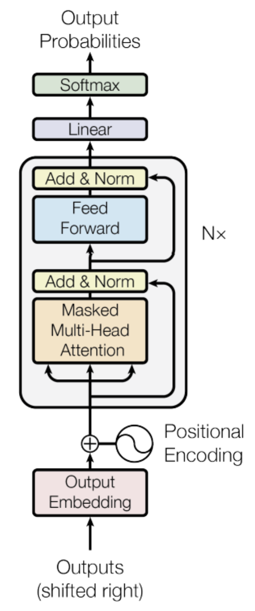

# GPT Model

A small PyTorch implementation of a GPT model (Decoder-only Transformer), with a focus on simplicity and readability. This model was built following Andrej Karpathy's nanoGPT lecture, which can be found [here](https://github.com/karpathy/ng-video-lecture). The model is trained on the [Tiny Shakespeare](https://raw.githubusercontent.com/karpathy/char-rnn/master/data/tinyshakespeare/input.txt) dataset. Below is an image of the model architecture:

