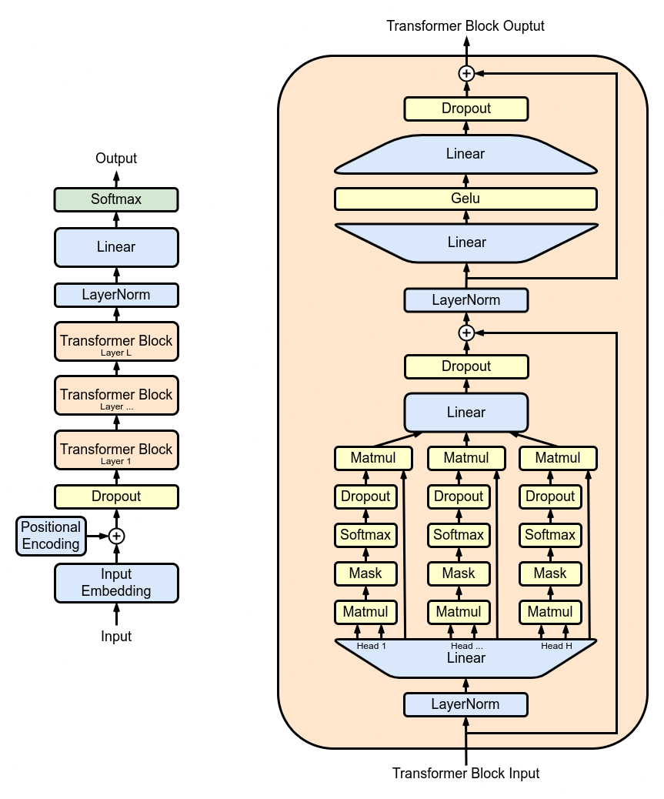

# GPT Model

A small PyTorch implementation of a GPT model (Decoder-only Transformer), with a focus on simplicity and readability. This model was built following Andrej Karpathy's nanoGPT lecture, which can be found [here](https://github.com/karpathy/ng-video-lecture). The model is trained on the [Tiny Shakespeare](https://raw.githubusercontent.com/karpathy/char-rnn/master/data/tinyshakespeare/input.txt) dataset. Below is an image of the model architecture:



Except that pre-layer normalisation is used instead of post-layer normalisation. To train the model, run the following command:

```bash
python train.py
```

## Tokeniser

Includes an implementation of a tokeniser, which is used to convert text into a sequence of tokens that can be fed into the GPT model. This tokeniser is based on the tokeniser used in the [GPT-2](https://d4mucfpksywv.cloudfront.net/better-language-models/language_models_are_unsupervised_multitask_learners.pdf) and follows the Byte Pair Encoding (BPE) algorithm as given in [minbpe](https://github.com/karpathy/minbpe/tree/master) by Andrej Karpathy.

Two tokenisers are implemented. `BasicTokeniser` is a basic BPE tokeniser that does not handle any special tokens or the regular expression splitting pattern and can be found in `basic.py`. `GPTTokeniser` is a more advanced tokeniser that can handle special tokens and the regular expression splitting pattern and can be found in `gpt.py`. Both tokenisers have the ability to save and load a tokeniser model from `.tkn` files. To train a tokeniser, run the following command:

```bash
python train_tokeniser.py
```